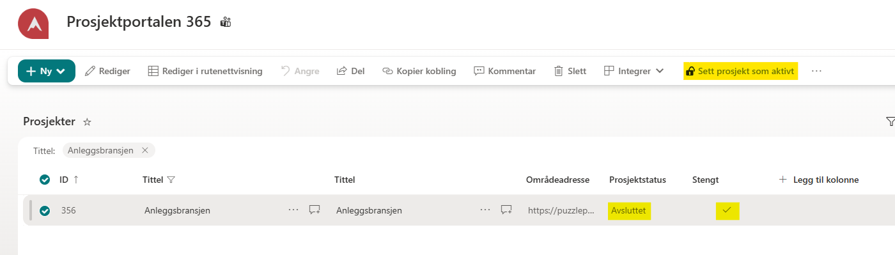
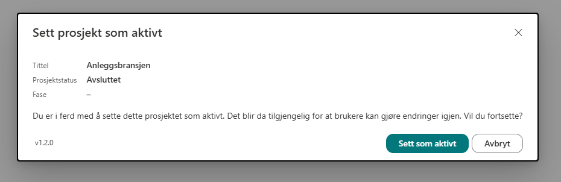
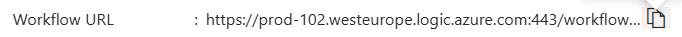

# Avanserte tillegg for Prosjektportalen 365

Avanserte tillegg automatiserer prosjektadministrasjon i Prosjektportalen. Tilleggene kan håndtere arkivstatus, oppfølgningsdatoer, tilgangsstyring og tilgangsforespørsler.

## Installasjon

Installering av alle komponenter foregår ved kjøring av `Deploy-Solution.ps1`. Om man skal ønsker en delvis installasjon er det nødvendig å inkludere flagg. Disse flaggene er definert i [Komponenter](#komponenter).

I tillegg til flagg, må også konfigurasjon fylles ut, disse ligger i `config` mappen.

Etter script er kjørt kreves noen manuelle steg.

1. Connectors må autentiseres med servicekonto.
2. PnP.PowerShell må legges til i Runtime for Runbooks. Grunnet kompatibilitet må PnP.PowerShell v 2.12.0 brukes og runtime må være PowerShell v7.2. PnP.PowerShell finnes i mappen `bundle`

## Komponenter

| Komponent | Funksjon | Trigger | Type | Flagg |
| --- | --- | --- | --- | --- |
| **Arkivering av prosjekt** | Setter prosjektet som arkivert | Prosjektfase settes til *"Ferdig"* | Automatisk | `PhaseChanged` |
| **Reaktivering av prosjekt** | Åpner et arkivert prosjekt igjen | Knappen **"Sett prosjekt som aktivt"** i Prosjekter-listen | Manuell | `ChangeArchiveState` |
| **Oppfølgingsdatoer** | Beregner befarings-, fravikelses- og reklamasjonsfrist | **Overleveringsdato** (`GtcHandoverDate`) fylles inn/endres | Automatisk |`ProjectInfoChanged`|
| **Prosjektleder + mappetilgang** | Bytter prosjektleder og styrer tilgang til anskaffelsesmapper | **Prosjektfase** (`GtProjectPhase`) endres | Automatisk |`ProjectInfoChanged`|
| **Hente prosjektinformasjon** | Henter prosjektegenskaper som hjelpejobb for de andre komponentene | Kalles internt av andre jobber | Automatisk |N/A|
| **Tilgangsforespørsel** | Sender godkjenning til prosjektleder/-eier om tilgang til valgte prosjekter | HTTP-kall fra Dynamisk liste-webpart | Manuell |`RequestProjectAccess`|

## Arkivering av prosjekt

Arkivering av prosjekt er en Logic App og en Runbook som trigges ved å legge til webhook ved fase-endring til en spesifikk fase, oftest siste fase. Det konfigureres en webhook for å trigge dette automatisk.

### Installasjon

Installeres ved å inkludere `-PhaseChanged` ved kjøring av .\Deploy-Solution.ps1.

## Reaktivering av prosjekt

Knappen **"Sett prosjekt som aktivt"** ligger i `Prosjekter`-listen og lar en områdeadministrator reaktivere
et arkivert prosjekt. Området blir skrivbart igjen for brukerne.

Kommandoen vises bare når alle disse er sanne:

- lista heter `Prosjekter`
- nøyaktig ett prosjekt er valgt
- du er områdeadministrator
- prosjektet er arkivert: `GtProjectLifecycleStatus` er `Avsluttet` og `GtIsArchived` er `Ja`

1. Marker det arkiverte prosjektet i **Prosjekter**-listen.
2. Klikk **"Sett prosjekt som aktivt"** i kommandolinjen 

3. Bekreft i dialogen.

3. Vent noen minutter. I bakgrunnen fjernes skrivebeskyttelsen, Teams åpnes igjen, status settes til
   **"Aktivt"** og arkivbanneret forsvinner.

Får du feilmeldingen *"Noe gikk galt. Prosjektet ble ikke aktivert."*, prøv igjen om et par minutter. Sjekk at du fortsatt har administratortilgang, og kontakt brukerstøtte hvis problemet vedvarer.

### Installasjon

Krever to-stegs installasjon.

Azure Komponent installasjon:
Installeres ved å inkludere `-ChangeArchiveState` ved kjøring av .\Deploy-Solution.ps1.

SPFx utvidelse installasjon
1. Workflow URL hentes fra Logic App

2. URL legges inn i `azureFunctionUrl` som finnes i `sharepoint/assets/elements.xml` og `sharepoint/assets/ClientSideInstance.xml` for bygging og deploy. (Dersom det skal testes lokalt legges den inn i `config/serve.json`)
3. Appen lastes opp i SharePoints app katalog. Den kan publiseres til alle sites, men dersom det ikke gjøres, må den legges til på Portefølje-hubben.

## Oppfølgningsdatoer

Oppfølgningsdatoer oppdaterer tre felter i Prosjektegenskaper: GtcYearInspectionDate, GtcWaiverDate, GtcComplaintDate.
Standard verdier er følgende:

Inspection Date er overleveringsdato + 1 år
Waiver Date er overleveringsdato + 3 år
Complaint date er overleveringsdato + 5 år

Feltene kan justeres via Azure Automation variabelen `DateCalculationRules`. Dersom overleveringsdato er tom vil ingenting bli utført.

### Installasjon

Installeres ved å inkludere `-ProjectInfoChanged` ved kjøring av .\Deploy-Solution.ps1.

Som standard følger både Prosjektleder + Mappetilgang og Oppfølgningsdatoer med i Logic Appen, så dersom det kun skal inkluderes Oppf;lgningsdatoer, må Prosjektleder + Mappetilgang fjernes fra Logic appen.

## Prosjektleder + mappetilgang

UpdateProjectManager setter riktig prosjektleder og sikrer tilgang til sensitive anskaffelsesmapper.

Den leser `GtProjectPhase`, `GtVeiPlanningManager` og `GtVeiProjectingManager` fra Prosjektegenskaper.

Hvis fasen er Planfase, settes `GtVeiPlanningManager` som `GtProjectManager`.

I alle andre faser settes `GtVeiProjectingManager` som `GtProjectManager`.
Deretter behandler den fem beskyttede mapper i dokumentbiblioteket, blant annet tilbud, kontrakter og kontrahering:

Første gang mappen behandles, brytes arvede tillatelser og prosjektlederen får Full Kontroll som standard. Ved senere kjøringer får den aktive prosjektlederen tilgang, men eksisterende unike og manuelt tildelte tillatelser beholdes.

Til slutt oppdaterer den GtProjectManager både i prosjektområdets Prosjektegenskaper og på tilsvarende prosjekt i hub-områdets Prosjekter-liste. Den identifiserer hub-raden ved å matche prosjektområdets URL mot GtSiteUrl.

### Installasjon

Installeres ved å inkludere `-ProjectInfoChanged` ved kjøring av .\Deploy-Solution.ps1.

Som standard følger både Prosjektleder + Mappetilgang og Oppfølgningsdatoer med i Logic Appen, så dersom det kun skal inkluderes Prosjektleder + mappetilgang, må dato steget fjernes fra Logic appen.

## Tilgangsforespørsel

Forenkler tilgangsforespørsler til prosjekter. Den trigges via `DynamicList` webparten.

Logic appen finner Prosjektleder og Prosjekteier fra Prosjekter-listen og sender en godkjenningsforespørsel på e-post med valg *Godkjenn* eller *Avslå*. Dersom forespørselen er godkjent blir brukeren som forespurte tilgang lagt til i Besøkende gruppen i SharePoint. Ved avslag blir det sendt epost til brukeren.

### Installasjon

Installeres ved å inkludere `-RequestProjectAccess` ved kjøring av .\Deploy-Solution.ps1.

Workflow URL hentes fra Logic Appen og legges til i `DynamicList` konfigurasjon som en custom aksjon.

## Trenger du hjelp?

Send e-post til brukerstøtte hvis du opplever problemer med avanserte tillegg.