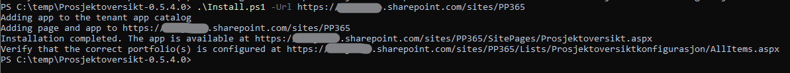

# Prosjektoversikt for Prosjektportalen 365

Denne webdelen viser alle prosjekter i Prosjektportalen 365, uavhengig av rettigheter. Webdelen gir ikke tilgang til selve prosjektene, men viser prosjektegenskapene og verdier fra siste statusrapport. Webdelen er uavhengig av PP365-installasjonen og kan dermed installeres hvor som helst i M365 tenanten. Kan for eksempel brukes til å vise alle prosjekter på en egen side på et intranett.

## Hvordan installere

1. Last ned release-pakken fra [Releases](https://github.com/Puzzlepart/prosjektportalen365-addons/releases) og pakk den ut lokalt
2. Sikre at du har en versjon av PnP PowerShell kjørende. Skriptet som ligger der nå fungerer med SharePointPnPPowerShellOnline (som er deprecated nå, men kan fortsatt brukes). Du kan for eksempel laste denne modulen fra Install-folderen til Prosjektportalen 365.
3. Kjør Install.ps1 med -Url (URL til området du skal installere webdelen i)
4. Verifiser at porteføljen(e) som skal vises er riktige på stien /Lists/Prosjektoversiktkonfigurasjon
5. Appen er tilgjengelig på /SitePages/Prosjektoversikt.aspx

